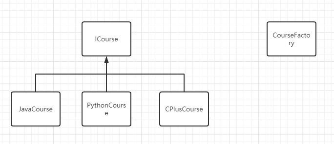
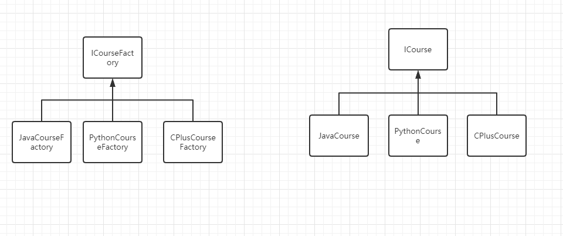

# FAQ作业问题

## 简单工厂

```java
interface ICourse{
}

class JavaCourse implement Icourse{
}

class CourseFactory{
    public static ICourse getBean(String name){
        if("java".equals(name)){
            return new JavaCourse()
        }
    }
}
```

类图



## 工厂方法

```java
interface ICourseFactory{
    ICourse create();
} 

class JavaCourse implements ICourseFactory{
    ICourse create(){
        return new JavaCourse();
    }
}

public static void main(String[] args){
    ICourseFactory factory = new JavaCourseFactory();
    ICourse course = factory.create()l
}

```

类图



## 抽象工厂

